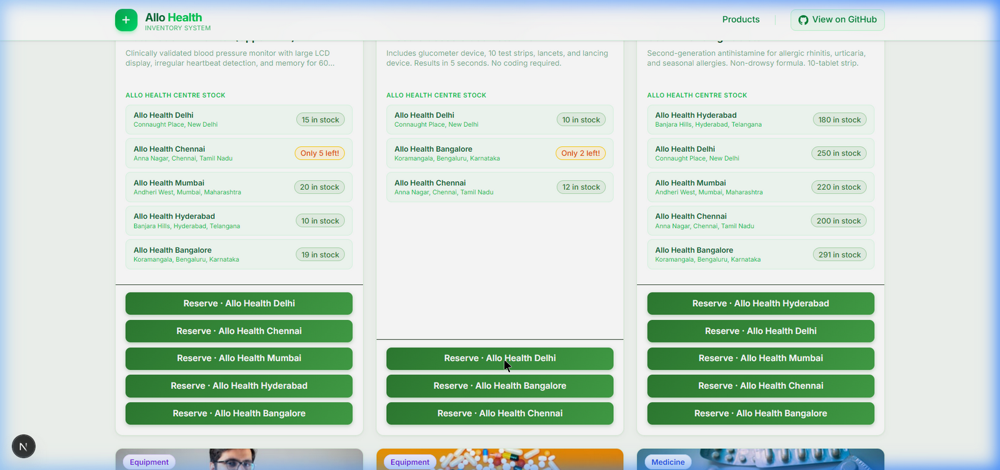
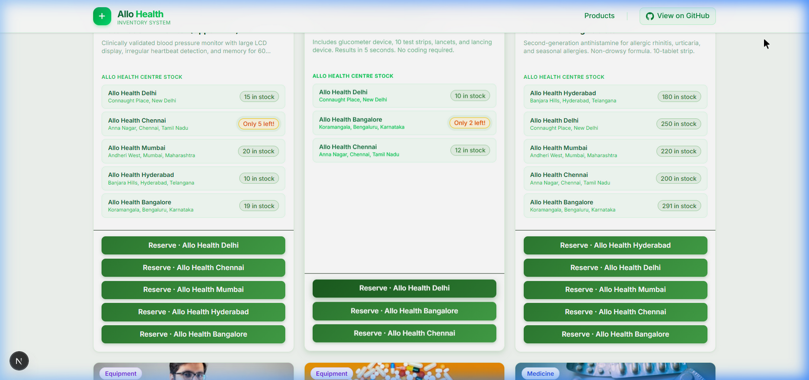
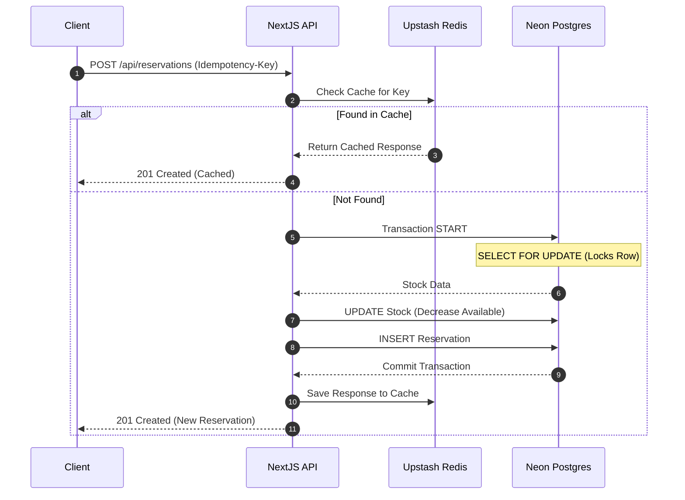

<div align="center">
  <h3>🌍 <a href="https://allo-health-project3.vercel.app/">Click Here : https://allo-health-project3.vercel.app/</a> 🌍</h3>
</div>

<div align="center">
  
</div>

<div align="center">
  
</div>

<br />

<div align="center">
  
  
  
  
  
</div>

<div align="center">
  <h3>🌍 <a href="https://allo-health-project3.vercel.app/">Live Deployment: https://allo-health-project3.vercel.app/</a> 🌍</h3>
</div>

<br />

Welcome to the **Allo Health Inventory System**! 👋 Built for the Allo Health Engineering team, this platform provides high-concurrency real-time reservations for medicines and medical equipment across multiple Allo Health centres in India.

## ✨ Features

- **💚 Dynamic Pharmacy Theme**: Clean, responsive, and beautiful light-green Material UI.
- **🛒 Real-time Inventory**: Accurate stock counting with distinct product categories (Medicines, Equipment, Diagnostics, Supplements).
- **⏱️ 10-Minute Hold Window**: When you reserve an item, stock is held for 10 minutes with a live visual countdown.
- **🔐 Pessimistic Locking**: Prevents race conditions! We use Postgres `SELECT FOR UPDATE` to ensure two users can't grab the last Metformin unit at the same time.
- **🛡️ Idempotent API**: Fully safe against double-clicks and network retries using Redis caching.
- **📋 My Reservations**: Keeps track of your orders locally so you can quickly see what you've reserved.

---

## 📸 Screenshots

### 1. The Pharmacy Homepage
Clean, responsive Material UI displaying live stock across 5 Allo Health centres.
<div align="center">
  
</div>

### 2. Reserving an Item
Reserve directly from the centre with the most stock. The UI shows low stock warnings and live quantity limits.
<div align="center">
  
</div>

### 3. Live Countdown Checkout
Once reserved, the inventory is locked. You have 10 minutes to confirm the purchase.
<div align="center">
  
</div>

---

## 🏗️ Architecture & How It Works

Here is a simple flow of what happens under the hood when you click "Reserve":



### Explanation in Easy Language 🎈

1. **You Click Reserve**: The browser sends a request with a special `Idempotency-Key` (a unique ID for that click).
2. **Checking the Cache**: Our server asks **Redis** if it has seen this click before. If yes, it just replies immediately! This prevents double charges.
3. **Locking the Drawer**: If it's a new request, our server tells the **Postgres Database** to "lock" the row for that specific medicine. It's like putting your hand on the drawer so no one else can open it.
4. **Reserving**: The server subtracts the requested quantity and creates a reservation ticket.
5. **Done!**: The drawer is unlocked, the response is saved in Redis, and you see the success message!

---

## 🚀 Getting Started

### Prerequisites
- Node.js 18+
- A Neon Postgres Database
- An Upstash Redis REST URL & Token

### Installation

1. Clone the repository:
   ```bash
   git clone https://github.com/theatharvagai/allo-health-project.git
   cd allo-health-project/Project/allo-inventory
   ```

2. Install dependencies:
   ```bash
   npm install
   ```

3. Setup Environment Variables (`.env`):
   ```env
   DATABASE_URL="postgresql://..."
   UPSTASH_REDIS_REST_URL="https://..."
   UPSTASH_REDIS_REST_TOKEN="..."
   RESERVATION_EXPIRY_MINUTES=10
   ```

4. Push the Database and Seed it! 🌱
   ```bash
   npx prisma db push
   npm run db:seed
   ```

5. Start the Dev Server:
   ```bash
   npm run dev
   ```

---

## 🌍 Live Deployment

The project is successfully deployed on Vercel. 

**🔗 Live Demo:** [https://allo-health-project3.vercel.app/](https://allo-health-project3.vercel.app/)

<div align="center">
  
</div>

---

## 👷‍♂️ Built By

**Atharva Gai**  
[GitHub Repository](https://github.com/theatharvagai/allo-health-project)

_Built as part of the Allo Health Engineering Take-Home Assessment._
